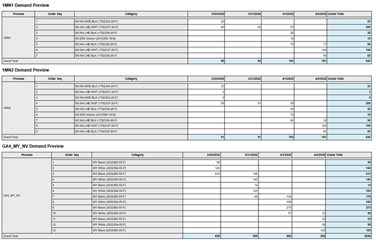
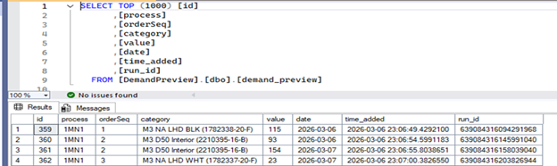
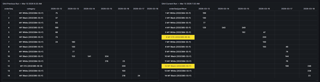
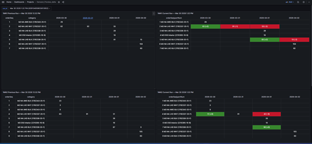

# demandpreview
Demand Preview Pipeline
Automated ETL pipeline and change-detection dashboard for hourly vehicle demand forecast data.
________________________________________
Overview
Every hour, an automated demand preview email arrives containing HTML tables with vehicle order forecasts broken out by production process (1MN1, 1MN2, GA4), order sequence, category, and date. Manually tracking what changed between each hourly run was time-consuming and error-prone.
This project solves that by automatically parsing each email, storing the data in SQL Server, and displaying a side-by-side delta dashboard in Grafana so analysts can instantly see what changed from one run to the next.
________________________________________
How It Works
Outlook Email (hourly)
        |
        v
 Power Automate Flow
  - Triggered on new email arrival
  - Splits HTML body into individual process tables
  - Parses each row: process, order sequence, category, date, value
  - Skips Grand Total rows
  - Inserts records into SQL Server with run_id + timestamp
        |
        v
  SQL Server Database
  [DemandPreview.dbo.demand_preview]
        |
        v
  Grafana Dashboard
  - Connects via MSSQL datasource
  - Side-by-side view: Previous Run vs. Current Run
  - Color-coded delta highlighting per process
  - Panels: 1MN1, 1MN2, GA4
________________________________________
Tech Stack
Tool	Purpose
Power Automate	Email trigger, HTML parsing, ETL orchestration
Office 365 Connector	Email ingestion via Outlook
SQL Server	Persistent storage of demand forecast records
T-SQL	Stored procedures + CTEs for delta comparison queries
Grafana	MSSQL-connected dashboard for run-over-run visualization
________________________________________
Power Automate Flow — demandpreview
Trigger: When a new email arrives (V3) — monitors a designated Outlook folder
Key steps:
1.	Fetches the full email body
2.	Splits the HTML into separate <table> blocks (one per process)
3.	Extracts date headers from each table's header row
4.	Loops through each data row, extracting: 
o	Process name (e.g. 1MN1, 1MN2, GA4_MY_NV)
o	Order sequence number
o	Category (vehicle config, e.g. M3 NA AWD BLK)
o	Value per date column
5.	Skips Grand Total rows
6.	Inserts each record into [dbo].[demand_preview] with a unique run_id (tick-based timestamp) and time_added
________________________________________
Grafana Dashboard — Demand_Preview_delta
The dashboard shows 6 panels — a Previous Run and Current Run table for each of the three processes:
•	1MN1 Previous Run / Current Run
•	1MN2 Previous Run / Current Run
•	GA4 Previous Run / Current Run
Each "Current Run" panel uses a CTE-based delta query to compare the latest run against the prior run, highlighting cells where values have changed. Dashboard variables (run_id, prev_run_id, run_time, prev_run_time) allow analysts to compare any two historical runs.
________________________________________
Database Schema
Table: DemandPreview.dbo.demand_preview
Column	Type	Description
process	varchar	Production process (e.g. 1MN1)
orderSeq	int	Order sequence number
category	varchar	Vehicle configuration string
date	date	Forecast date
value	int	Demand quantity
time_added	datetime	When the record was inserted
run_id	bigint	Unique ID per email run (tick-based)
Stored Procedure: DemandPreview.dbo.sp_demand_preview_matrix Pivots demand data into a matrix format (dates as columns) for a given run_id and process.
________________________________________
Repository Structure
demand-preview/
├── README.md
├── power-automate/
│   └── demandpreview.zip        # Exportable Power Automate flow package
├── grafana/
│   └── demandpreviewdelta.json  # Grafana dashboard JSON (importable)
└── screenshots/
    └── email-sample.png         # Example of the source demand preview email
________________________________________
Setup & Deployment
Power Automate
1.	In Power Automate, go to My Flows → Import
2.	Upload demandpreview.zip
3.	Map the connections: 
o	Office 365 → your Outlook account
o	SQL Server → your SQL Server instance and DemandPreview database
4.	Enable the flow
Grafana
1.	In Grafana, go to Dashboards → Import
2.	Upload demandpreviewdelta.json
3.	Select your MSSQL datasource pointing to the DemandPreview database
4.	Save — the dashboard variables will populate automatically from the database
________________________________________
## Screenshots

**Source Email**

**SQL Database**

**Grafana Delta Dashboard**

________________________________________
Author
AJ Ono
https://www.linkedin.com/in/aj-ono
713-823-4873
ajkono2@gmail.com

